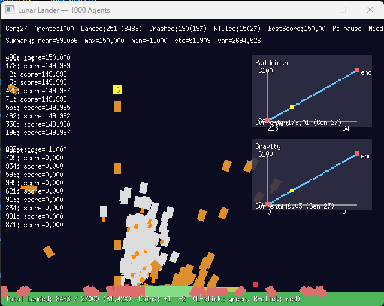

# Lunar Lander Coach

An evolutionary training simulator that uses genetic algorithms to teach 1000 agents (500 neural network + 500 rulebook) to land on the moon using curriculum learning.

## Overview

This project simulates 1000 lunar lander agents simultaneously:
- **500 Neural Network agents** (white/gray): Controlled by small neural networks
- **500 Rulebook agents** (orange): Controlled by evolved rule-based policies

Through evolutionary algorithms (selection, crossover, mutation) and **curriculum learning**, the agents progressively learn to:
- Navigate to the landing pad
- Control velocity and orientation
- Collect green coins (+1 score) and avoid red coins (-1 score)
- Successfully land within the landing pad boundaries
- Adapt to increasing difficulty over 100 generations

## Features

- **Dual Policy Types**: Neural networks and rulebook policies evolve in parallel populations
- **Curriculum Learning**: Progressive difficulty ramping over generations
  - Landing pad width: starts at 1/3 screen width → reduces to 1/10 by generation 100
  - Gravity: starts at 0.02 (easy) → increases to 0.06 (realistic) by generation 100
- **Interactive Difficulty Sliders**: Visualize and adjust curriculum progression in real-time
- **Genetic Evolution**: Elite preservation (~10%), tournament selection, crossover, and mutation
- **Hall of Fame**: Top 10 champions per policy type across all generations (marked with blue borders)
- **Interactive Environment**: Place coins and move spawn point while paused
- **Performance Tracking**: Running totals and percentages of successful landings
- **Data Export**: CSV and JSON files saved for each generation

## Screenshot



## Controls

- **P**: Pause/unpause simulation
- **Left Click** (while paused): Add green coin (+1 score) OR drag slider control points
- **Right Click** (while paused): Add red coin (-1 score)
- **Middle Click** (while paused): Move spawn point
- **Click existing coin**: Remove it
- **Drag red control points on sliders**: Adjust curriculum difficulty progression

## Running the Simulator

1. Ensure you have Go installed (1.20+ recommended)
2. From the project directory run:

```bash
go build
./lunar-lander-coach
```

Or directly:
```bash
go run .
```

## Neural Network Architecture

Each NN agent has 4 independent neural network heads (one per action):
- **Inputs (10)**: horizontal offset, vertical offset, x velocity, y velocity, angle, sin(angle), cos(angle), speed, distance to closest green coin, distance to closest red coin
- **Actions (4)**: nop, main thrust, right thrust, left thrust
- **Output**: Softmax distribution over actions (currently using argmax for deterministic selection)

## Rulebook Policy Architecture

Each rulebook agent has 32 rules that modify action probabilities:
- **Rule structure**: IF (inputIndex < threshold) THEN modify action probability
- **Inputs**: Same 10 features as neural networks
- **Actions**: Same 4 actions with probability-based selection
- **Evolution**: Rules mutate their thresholds and modifiers

## Curriculum Learning

The difficulty progressively increases over 100 generations:

| Generation | Pad Width | Gravity | Description |
|------------|-----------|---------|-------------|
| 0 | ~213 px (1/3 screen) | 0.02 | Easy: wide pad, low gravity |
| 50 | ~138 px | 0.04 | Medium difficulty |
| 100+ | ~64 px (1/10 screen) | 0.06 | Hard: narrow pad, realistic gravity |

**Interactive Sliders** (visible when paused):
- Two sliders show the progression curves for pad width and gravity
- Y-axis: Generation (0-100)
- X-axis: Variable value
- Red control points: Drag to adjust start/end values
- Blue curve: Shows progression path
- Yellow marker: Current generation position

## Evolution Parameters

- **Population**: 1000 agents total
  - 500 Neural Network agents
  - 500 Rulebook agents
- **Elite preservation**: ~10% per population (exact clones, never mutated)
- **Hall of Fame**: Top 10 champions per policy type preserved across all generations
- **Mutation rate**: 8%
- **Mutation scale**: 0.05
- **Selection**: Tournament selection (size 3) from top 50%
- **Episode length**: 400 steps

## Scoring System

Agents are scored based on:
- Horizontal distance from landing pad center
- Height above ground
- Velocity magnitude
- Angle deviation from upright
- Landing bonus: +50 points
- Coin collection: +1 per green, -1 per red

Only agents landing within the landing pad boundaries count as successful landings.

## Data Output

Each generation saves to `data/`:
- `YYYY-MM-DD_HH-MM-SS.csv`: All agent states (position, velocity, landed/crashed/killed status, scores)
- `landed_weights_YYYY-MM-DD_HH-MM-SS_SCORE.json`: Neural network weights for all agents that successfully landed

## Technologies

- Go 1.20+
- [Ebiten v2](https://github.com/hajimehoshi/ebiten) for rendering and input
- Custom neural network package (`nn/`) with genetic operators

## File Structure

- `main.go`: Main game loop, rendering, evolution, summary display
- `game.go`: Game struct, physics simulation, coin collection, curriculum sliders
- `types.go`: Core types (Environment, Lander, Agent, Policy, Coin, Rule, Rulebook)
- `policy.go`: Neural network and rulebook policy implementations
- `rulebook.go`: Rulebook-specific genetic operators (crossover, mutation)
- `scoring.go`: Fitness/scoring functions
- `nn/nn.go`: Neural network module with mutation and crossover

## Notes

- **Curriculum learning** helps agents learn progressively from easy to hard conditions
- **Dual populations** allow comparison between neural networks and rule-based approaches
- Tweak evolution parameters in `evolvePopulation()` for different training dynamics
- Adjust scoring weights in `scoring.go` to prioritize different behaviors
- Modify curriculum settings in sliders or initial values in `NewGame()`
- Champions (blue-bordered agents) are preserved across generations and never mutated
- Coins persist across generations but reset their collected state each episode
- Fixed spawn point at top center (can be moved via middle-click while paused)
- Neural network agents appear white/gray, rulebook agents appear orange
- With 1000 agents, evolution explores a much larger solution space per generation

